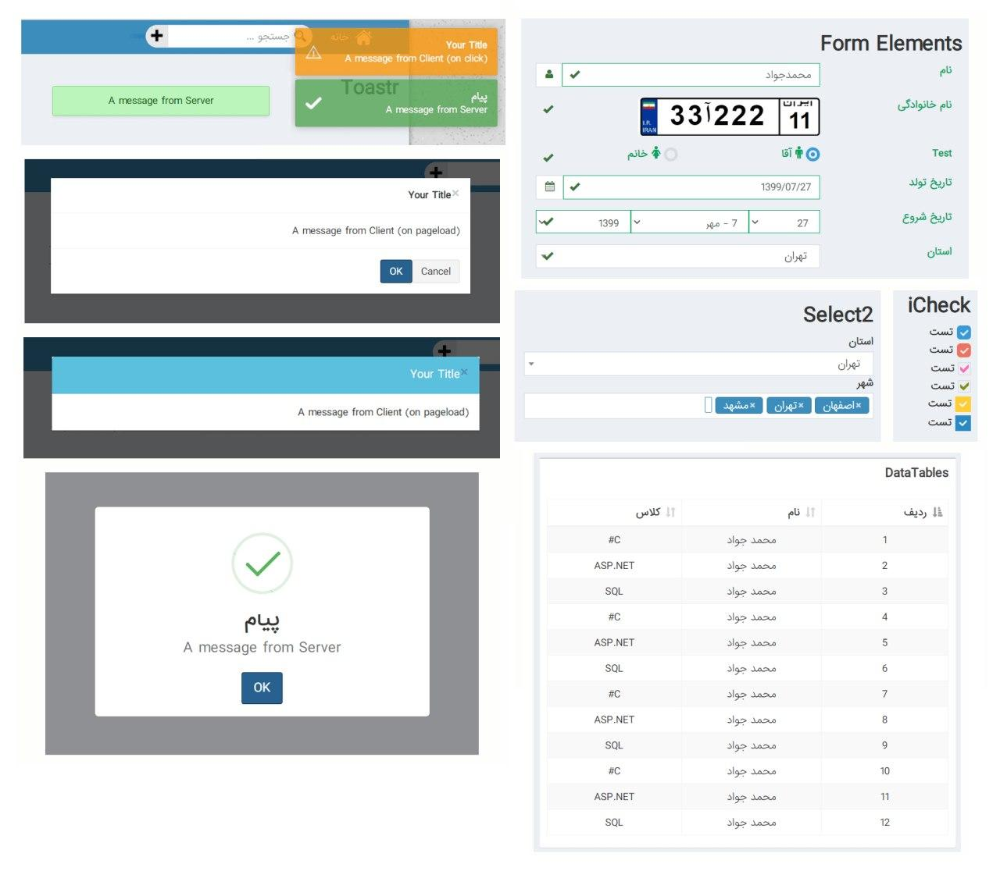

# PersianComponents

A set of useful UI-Components (HtmlHelper) for ASP.NET Core MVC based-on Popular JavaScript Plugins (Experimental project).

## Components

| Target | Branch | Version |
| ------ | ------ | ------ |
| Github | master | v1.0.0 | 

## Persian Identity Public Version
| Target | Branch | Version | Download link | Total downloads | GitHub Actions |
| ------ | ------ | ------ | ------ | ------ | ------ |
| Nuget | master | v1.0.0 |  |  |  |

- [Select2](https://select2.org/)
- [CKEditor](https://ckeditor.com/)
- [DataTables](https://datatables.net/)
- [iCheck](http://icheck.fronteed.com/)
- [DateRangePicker](http://www.daterangepicker.com/) (with jalaali support)
- [SweetAlert](https://sweetalert.js.org/)
- [Bootstrap-SweetAlert](https://lipis.github.io/bootstrap-sweetalert/)
- [Noty](https://ned.im/noty/)
- [Toaster](https://codeseven.github.io/toastr/)
- [Bootstrap3-Dialog](http://nakupanda.github.io/bootstrap3-dialog)
- [BootboxJS](http://bootboxjs.com/)
- [InputMask](https://robinherbots.github.io/Inputmask/)
- [Bootstrap-TagAutoComplete](https://blog.sandglaz.com/bootstrap-tagautocomplete/)
- [Typeahead.js](http://twitter.github.io/typeahead.js/)
- [Bootstrap-FileInput](https://plugins.krajee.com/file-input)
- [Jasny-FileInput](https://www.jasny.net/bootstrap/components/#fileinput)
- [Fuelux-Wirzard](https://github.com/ExactTarget/fuelux)
- [Bootstrap-Maxlength](http://mimo84.github.io/bootstrap-maxlength/)
- [Handlebars](https://handlebarsjs.com/)
- Bootstrap-PersianDateTimePicker

## Features

- Easy-to-Use with just one line of code.
- Fully Configuralbe for each component.
- Add necessary CSS (to top) and JS (to down) resources automatically when you use a component and remove tags when you no longer use it.
- No need to deal with a specific script code for each component.
- Includes a Variety of components.
- Usable in View and PartialView.
- Usable with Ajax and Non-Ajax requests.
- Using CDN resources instead of Locale Embedded resources (Optional).
- Lightweight with small footprint.

## Demo

<!--
### Roadmap:

I will add or supplement these plugins in the future if I have the time.

You can suggest the plugins you need in [issues](https://github.com/mjebrahimi/DNZ.MvcComponents/issues/new)

- [ ] AutoComplete
- [ ] [TagsInput](https://bootstrap-tagsinput.github.io/bootstrap-tagsinput/examples/)
- [ ] DateTimePicker
- [ ] TinyMCE
- [ ] CKEditor
- [ ] DataTables
- [ ] [JsTree](https://github.com/vakata/jstree) | [TreeView](http://jonmiles.github.io/bootstrap-treeview/)
-->
